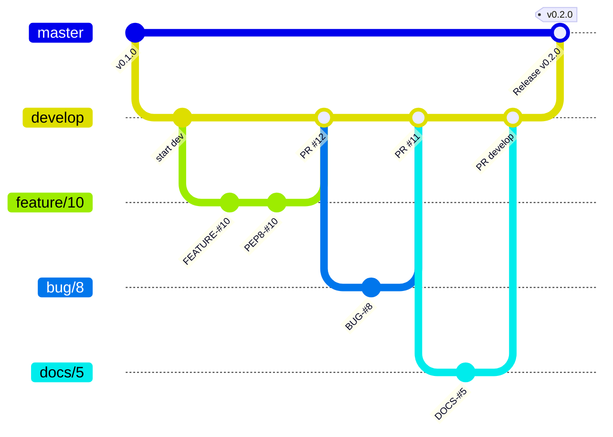

# Contributing to Dotflow Templates

## Getting Help

We use GitHub issues for tracking bugs and feature requests and have limited bandwidth to address them. If you need anything, I ask you to please follow our templates for opening issues or discussions.

- 🐛 [Bug Report](https://github.com/dotflow-io/templates/issues/new/choose)
- 📕 [Documentation](https://github.com/dotflow-io/templates/issues/new/choose)
- 🚀 [Feature Request](https://github.com/dotflow-io/templates/issues/new/choose)
- 💬 [General Question](https://github.com/dotflow-io/templates/issues/new/choose)

## Git Workflow

This project follows a **Git Flow** branching model. All development happens on the `develop` branch — never commit directly to `master`.



### Branch Naming

All branches must be created **from `develop`** and follow the pattern:

| Type | Pattern | Example | When to use |
|------|---------|---------|-------------|
| Feature | `feature/<ISSUE-NUMBER>` | `feature/10` | New functionality |
| Bug Fix | `bug/<ISSUE-NUMBER>` | `bug/8` | Fixing a reported bug |
| Documentation | `docs/<ISSUE-NUMBER>` | `docs/5` | Documentation-only changes |
| Release | `release/<VERSION>` | `release/1.0.0` | Preparing a new release |

### Creating a Branch

```bash
git checkout develop
git pull origin develop
git checkout -b feature/10
```

## Commit Style

Every commit must follow the format:

```
<emoji> <TYPE>-#<ISSUE-NUMBER>: <Description>
```

| Icon | Type      | Description                                |
|------|-----------|--------------------------------------------|
| ⚙️   | FEATURE   | New feature                                |
| 📝   | PEP8      | Formatting fixes following PEP8            |
| 📌   | ISSUE     | Reference to issue                         |
| 🪲   | BUG       | Bug fix                                    |
| 📘   | DOCS      | Documentation changes                      |
| 📦   | PyPI      | PyPI releases                              |
| ❤️️   | TEST      | Automated tests                            |
| ⬆️   | CI/CD     | Changes in continuous integration/delivery |
| ⚠️   | SECURITY  | Security improvements                      |

### Examples

```
⚙️ FEATURE-#10: Add Kubernetes deployment template with Helm chart
🪲 BUG-#8: Fix post_gen_project hook failing on Windows
📘 DOCS-#5: Add cloud platform comparison table to README
📝 PEP8-#10: Apply ruff format to hook scripts
❤️ TEST-#10: Add tests for cookiecutter template generation
📌 ISSUE-#10: Resolve merge conflict with develop
```

## Pull Requests

### Target Branch

- Feature/bug/docs branches → open PR against **`develop`**
- Release branches → open PR against **`master`**

### PR Guidelines

When opening a PR, fill out the provided template:

1. **Description** — Summarize the changes and link the related issue
2. **Type of change** — Check the appropriate box (bug fix, feature, breaking change, docs)
3. **Checklist** — Confirm code quality, tests, and documentation

### Before Opening a PR

- [ ] Code follows the project style guidelines
- [ ] Self-review completed
- [ ] Tests added/updated and passing locally
- [ ] No new warnings introduced
- [ ] Documentation updated (if applicable)

## Code Quality

### Linting & Formatting

This project uses **ruff** for formatting and linting.

```bash
# Format code
ruff format .

# Check linting
ruff check .
```

### Validating Templates

Test that the cookiecutter template generates correctly:

```bash
# Generate a project with default options
cookiecutter . --no-input

# Generate with specific options
cookiecutter . --no-input project_name=test_pipeline storage=s3 cloud=lambda
```

### Tests

Run the test suite with:

```bash
pytest
```

## Project Structure

```
templates/
├── cookiecutter.json                  # Template variables and options
├── hooks/                             # Cookiecutter hooks
│   └── post_gen_project.py            # Post-generation cleanup
├── cloud/                             # Cloud deployment templates
│   ├── docker/                        # Docker Compose files
│   ├── lambda/                        # AWS Lambda (SAM/CDK)
│   ├── lambda-scheduled/              # Lambda + EventBridge
│   ├── lambda-s3-trigger/             # Lambda + S3 trigger
│   ├── lambda-sqs-trigger/            # Lambda + SQS trigger
│   ├── lambda-api-trigger/            # Lambda + API Gateway
│   ├── ecs/                           # AWS ECS (Fargate)
│   ├── ecs-scheduled/                 # ECS + EventBridge
│   ├── cloud-run/                     # Google Cloud Run
│   ├── cloud-run-scheduled/           # Cloud Run + Scheduler
│   ├── kubernetes/                    # Kubernetes manifests
│   ├── github-actions/                # GitHub Actions workflow
│   ├── alibaba-fc/                    # Alibaba Cloud FC
│   ├── alibaba-fc-scheduled/          # Alibaba FC + Timer
│   └── registry.json                  # Platform registry
└── {{cookiecutter.project_name}}/     # Generated project
    ├── pyproject.toml                 # Project dependencies
    ├── tests/                         # Test suite
    └── {{cookiecutter.module_name}}/  # Pipeline module
```

## Development Setup

```bash
# Clone the repository
git clone https://github.com/dotflow-io/templates.git
cd templates

# Install cookiecutter
pip install cookiecutter

# Test template generation
cookiecutter . --no-input

# Run the generated project
cd my_pipeline
pip install -e .
```

## Summary

1. **Branch from `develop`** using the naming convention
2. **Commit** with emoji + type + issue number
3. **Open a PR** against `develop` (or `master` for releases)
4. **Pass all checks** — linting, tests, and self-review
5. Wait for code review and approval before merging
